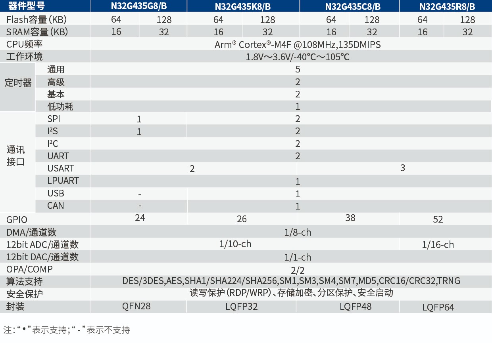

# [N32G435](https://www.soc.xin/N32G435)

* [Nationstech](https://www.nationstech.com/): [Cortex-M4F](https://github.com/SoCXin/Cortex)
* [L2R2](https://github.com/SoCXin/Level): 108 MHz , [￥5.2 (QFN28)](https://detail.tmall.com/item.htm?abbucket=4&id=681233572923&rn=42d8fd34ef2a7f4203198c459ecb8299&spm=a1z10.5-b-s.w4011-24475232746.30.9b014aecSdhpfT)

## [简介](https://github.com/SoCXin/N32G435/wiki)

[N32G435](https://www.nationstech.com/N32G435/) 系列采用32 bit Arm® Cortex®-M4F内核，最高工作主频108MHz，支持浮点运算和DSP指令，集成高达 128KB嵌入式加密Flash，32KB SRAM，集成丰富的高性能模拟器件，内置1个12bit 5Msps ADC，2路独立轨到轨 运算放大器，2个高速比较器，1个1Msps 12bit DAC，集成多路U(S)ART、I2C、SPI、USB、CAN等数字通信接口，内置多种密码算法硬件加速引擎。

### 关键参数

* 108 MHz Cortex-M4F (DSP)
* 32KB SRAM + 128KB Flash
* 12-bit ADC 5Msps
* 12-bit DAC 1Msps
* 2x CMP + 2x OPA
* USB + USART + SPI + I2C + CAN

## [资源收录](https://github.com/SoCXin)

* [参考资源](src/)
* [参考文档](docs/)
* [参考工程](project/)

## [选型建议](https://github.com/SoCXin/N32G435)

[N32G435](https://item.szlcsc.com/3099941.html) 5Msps ADC非常强大，同时具备USB外设，适用于工具场景。简配版本包括 [N32G430](https://github.com/SoCXin/N32G430)

该型号特点是ADC采样速率较高，但只配置单路，长板不长，对标[STM32G431](https://github.com/SoCXin/STM32G474)性价比优势不明显。
